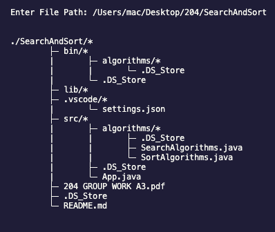

# FileStructure-To-Text

## Overview

`FileStructure-To-Text` is a simple Python program that generates a text-based representation of a directory's structure. It takes a folder as input and recursively traverses its subdirectories, printing out the structure in a clear, tree-like format.

## Features

- Recursively traverses directories and subdirectories.
- Differentiates between files and directories in the output.
- Provides a clean and organized visual representation of a folder's structure.
- Allows specifying commands like install, uninstall, or a folder name directly.
- Includes an installation script to set up a command-line tool.
- Provides an uninstall script to remove the command-line tool and its associated files.
Error Handling: Includes robust error handling for file and directory operations.


## Example Output

When you run the program on a folder, the output will look something like this:



```graphql


# Absolute File Path: /Users/mac/Desktop/204/SearchAndSort


./SearchAndSort/*
        ├─ bin/*
        |       ├─ algorithms/*
        |       |       └─ .DS_Store
        |       └─ .DS_Store
        ├─ lib/*
        ├─ .vscode/*
        |       └─ settings.json
        ├─ src/*
        |       ├─ algorithms/*
        |       |       ├─ .DS_Store
        |       |       ├─ SearchAlgorithms.java
        |       |       └─ SortAlgorithms.java
        |       ├─ .DS_Store
        |       └─ App.java
        ├─ 204 GROUP WORK A3.pdf
        ├─ .DS_Store
        └─ README.md


```
bash

## How to Use

1. **Clone the Repository:**
   - Clone this repository to your local machine using the following command:
   ```bash
    git clone https://github.com/Programming-Sai/FileStructure-To-Text.git
   ```
2. **Navigate to the Folder:**

- Change into the directory where the script is located:
    ```bash
    cd FileStructure-To-Text
    ```
3. **Execute the Python script by running:**

    ```bash
    python main.py
    
    OR

    python3 main.py
    ```
4. **Input Folder Path:**

- When prompted, enter the absolute path of the folder whose structure you want to visualize.


5. **Installation:**
-  Run the following command after cloning and navigating into the project directory in order to install the script:

``` bash
sudo python3 -u main.py install (On Mac)

python main.py install (On Windows)
```

- Run this command in order to verify the installation.

``` bash 
ftt
```

you should see something like this

``` graphql

./FTT/*
        ├─ setup.bat
        ├─ setup.sh
        ├─ .DS_Store
        ├─ uninstall.bat
        ├─ uninstall.sh
        ├─ README.md
        └─ main.py
```

- You can then use the command like so:

```bash 
ftt <Folder-name>
```


6. **Uninstallation (Optional):**
-  Run the following command after installtion in order to uninstall the command:

``` bash
sudo ftt uninstall (On Mac)

ftt uninstall (On Windows)
```


## Requirements
Python 3.x


